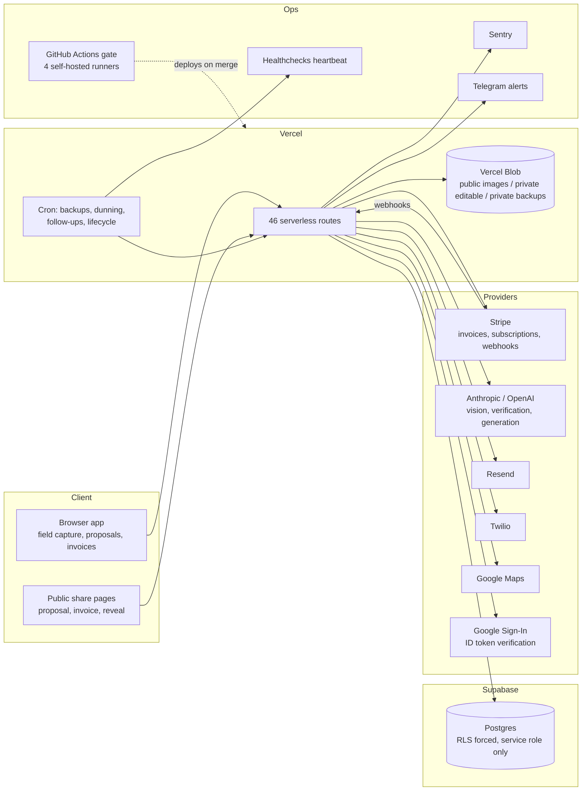
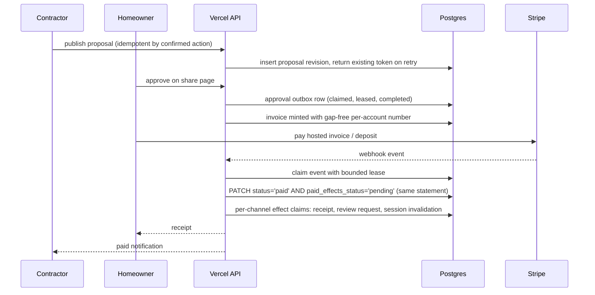
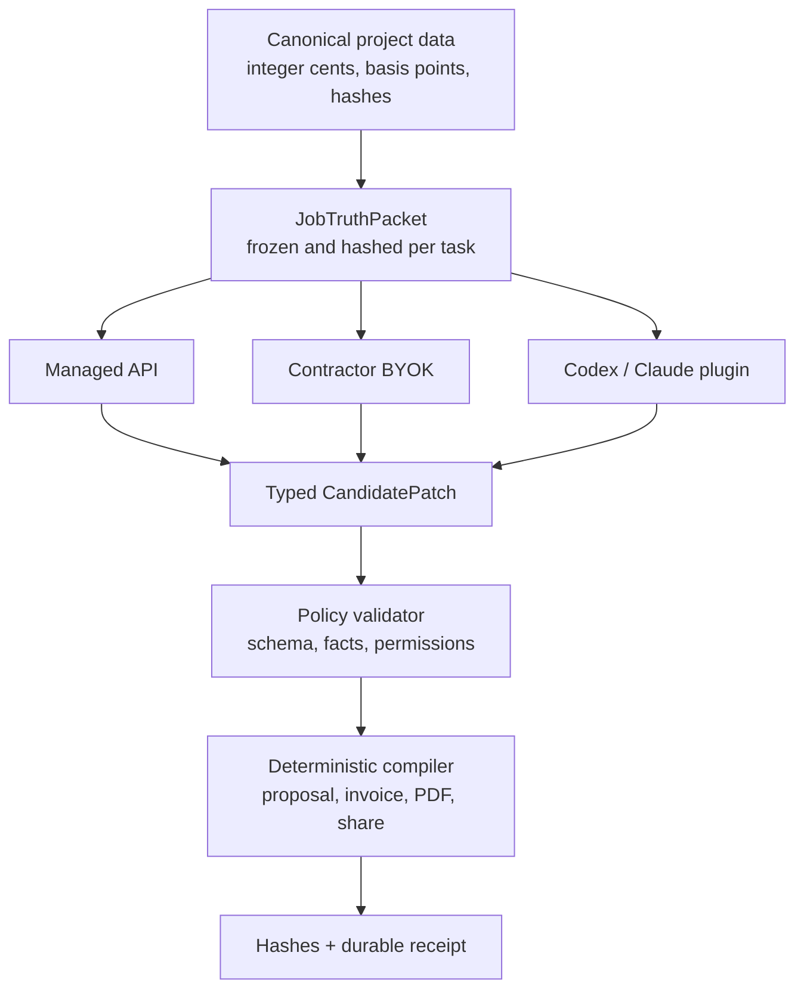

# LightDeck architecture

How a solo founder-operator's vertical SaaS is built, run, and kept honest. [LightDeck](https://www.lightdeck.tech) is a field, proposal, and invoicing workspace for landscape lighting contractors. I built it for my own company first, then shipped it for the trade.

The private repository is 2,785 commits over 98 days. This repo is the public architecture record: the system, the request flows, the tenancy and safety model, the test strategy, and the decisions with their reasons. The SQL behind the database patterns is in [supabase-production-patterns](https://github.com/ZCOLLINSKY/supabase-production-patterns).

Published 2026-09-03, extracted from the private repository so the work is inspectable ahead of Supabase Select. The commit dates here are the extraction date, not when the code was written; the SQL headers carry their own authoring dates.

## System

The browser never reads application data from Supabase directly. Sign-in is Google Sign-In with the ID token verified server-side, plus LightDeck-minted magic links and sessions stored in Postgres. Every database call goes through the API with the service role. That single choice is what makes "RLS on, no browser policies, deny by default" safe to enforce.

## Money path

Two rules make this survivable: the webhook is claimed before any effect runs, and the "paid" commit and the "effects pending" marker are the same write. A crash anywhere after that leaves durable work for the sweep, not a customer who paid and never got a receipt.

## AI boundary

LightDeck is the system of record and the artifact compiler. Models are replaceable workers.

A model may propose bounded copy, classifications, placement suggestions, or image pixels. It may never be the source of truth for money, identity, legal terms, project state, or what gets sent. Every AI task starts from an immutable truth packet; a missing fact is `null` or listed in `unknowns`, never replaced with a plausible default inside a prompt. Renders are verified by a second model against the design before they are shown, and each one is bound to a receipt of the hashes that produced it. Full decision record: [docs/ai-runtime-architecture.md](docs/ai-runtime-architecture.md).

## Tenancy

- Tenant-scoped tables carry `account_id`. The render receipt tables carry a SHA-256 `account_ref` instead of the raw id, so a receipt cannot name a client. A handful of platform-level logs predate the tenancy work and carry neither. Opaque ids are `text` matching a strict charset regex enforced by `CHECK`, never filenames.
- Composite tenant keys lead every primary key and index in the rendering spine schema, after two accounts sharing a project id and source id produced a byte-identical cache key. That cross-tenant hit is the reason the tuple is never narrowed.
- One named escape hatch, `LIGHTDECK_SINGLE_TENANT`, lives in a single gate. Without it, an unset primary account id denies every account rather than allowing every account, and API tests pin both behaviors.
- Sessions, magic links, and team invites are server-minted tokens stored in Postgres with uniqueness enforced in the database. Owner sign-in verifies a Google ID token against Google's tokeninfo endpoint with a hard deadline so a hung socket cannot stall the sign-in path.

## Limits and circuits

- **Rate limits** live in Postgres (`charge_ai_usage`) because serverless instances share nothing. On Vercel the limiter fails closed by construction.
- **AI spend** has per-account daily and monthly unit caps, a fleet-wide daily cap, an org-level monthly dollar ceiling, and a render verifier circuit that a single unavailable verification verdict closes for the rest of the window and the next one, so a cold start cannot buy another image. All are environment-configured and enforced server-side.
- **Outbound messages** pass one gate: per-account halt rows, daily caps, per-recipient cooldown via salted hash, dedupe replay, and actor attribution, in one table. The global halt is an env flag so it works while the database is down.
- **Render budgets** are time-boxed with a retry reserve so a slow provider cannot eat the function's wall clock.

## Tests and gate

470 Playwright spec files: regression 340, end-to-end 113, mobile 9, accessibility 3, adversarial 2, one desktop visual spec carrying 12 committed baselines, plus an integration spec and a seed spec. 517 files live under `tests/` once fixtures, helpers, and baseline images are counted.

The production branch is protected by a gate that runs on four self-hosted Mac runners: a foundation job (source and browser-global contracts, API and money-path contracts, desktop visual baselines with zero retries, repository health) plus four browser shards. The gate uploads a compact integrity receipt on green runs and full HTML diagnostics only on failure, with short retention, after green runs started exhausting the repository's Actions artifact allowance.

Tests have to mean what they say: the shared fixture fails any spec that silently leaves a real API call unmocked, which is how a green run stops certifying a stub. The adversarial lane drives the app as hostile personas and at volume, and a required adversarial review check sits on the production branch alongside the gate. Audit waves re-run the gate on the integrated head and trace every failure to a root cause before merge.

## How the code gets written

I run fleets of Claude Code and Codex agents. They open PRs against the production branch; the gate judges them; audit waves re-run the gate on the integrated head and trace every failure to a root cause before merge. A hardening audit this week shipped three waves as three gated PRs in one day: cohort and sign-in hardening, then the money path and render economics, then observability, the migration ledger, onboarding edges, and runbooks. The agents type. The gate, the receipts, and I decide.

## Decisions

**Postgres ledger for rate limiting.** The limiter runs as one atomic RPC in the database the app already depends on, so it has no second outage mode and fails closed with the same dependency as everything else.

**Fail closed in production, degrade in development.** The rate limiter and the render attempt store refuse in production when their backing table is unreachable. The outbound gate splits deliberately: the halt flag is an env var and needs no database, so the one control that must work in an outage does, while caps and dedupe degrade and log it. The alternative is silently unlimited spend during exactly the incidents that make tables unreachable.

**Service role only, RLS forced anyway.** The browser has no data path, so RLS could look redundant. It is not: it turns the architecture into a database invariant. On 2026-09-03 a probe with the public anon key against six PII tables returned 401, permission denied for schema public, and the catalog showed row security enabled on 37 of 37 public tables. An event trigger in the lockdown migration extends the same treatment to objects nobody has written yet, and the migration verifies itself with a probe object before it commits.

**Append-only receipts instead of mutable status columns.** Provenance you can edit is not provenance. Hash-bound rows with a mutation-rejecting trigger are the audit trail for every AI render a homeowner sees.

**Outbox in the row, not a separate queue.** Writing `paid_effects_status='pending'` in the same statement as `status='paid'` removes the window where a queue enqueue could fail after the commit. The sweep is the consumer.

**One outbound gate table.** Four controls that must agree (halt, cap, cooldown, dedupe) are cheaper to reason about, and to halt, when they share a ledger. Before this module existed, the only way to stop an agent emailing homeowners at 2am was pulling the Vercel deployment or the email provider key, and the second also breaks sign-in email.

**Self-hosted runners.** Four macOS runner processes on hardware I own give deterministic browser environments and let the full gate, including desktop visual baselines at zero retries, run on every PR. Shards queue when fewer runners are online.

**Models never own money or identity.** The recorded decision is a typed truth packet and a policy validator, so switching providers can never change a total, a deposit, a warranty, or a share link. The proposal writer path is built to that contract today; carrying it through every remaining UI surface is tracked work, not a finished state.

## Runbooks

- [docs/incident-rollback.md](docs/incident-rollback.md): decide whether it is a rollback, find previous-good, emergency instant rollback, verification triple, mandatory revert PR the same night, and the write-up.
- Backup and restore lives with the SQL in the patterns repo.
- Secret rotation and production migration go/no-go lists exist privately; the migration runbook requires a verified count of migrations, indexes, constraints, and RPCs from a clean release commit before the SQL editor is opened.

## Sources

Every claim above maps to a file in the private repository; see [SOURCES.md](SOURCES.md).

## Author

Zach Collins. Army veteran, founder-operator of a lighting installation company in Central Kentucky, and the solo builder of LightDeck. [github.com/ZCOLLINSKY](https://github.com/ZCOLLINSKY) · [LinkedIn](https://www.linkedin.com/in/zachcollins-ky)
