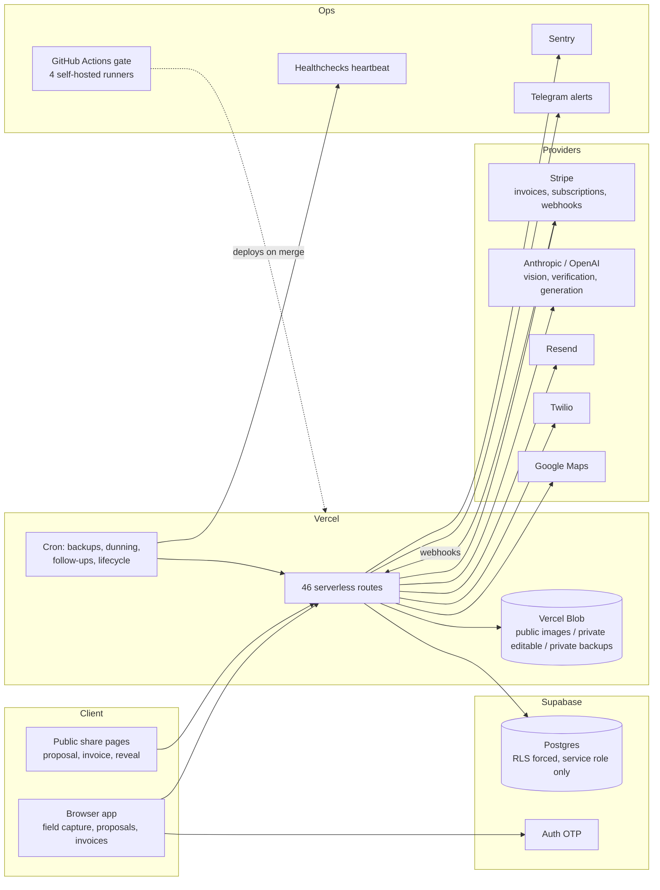
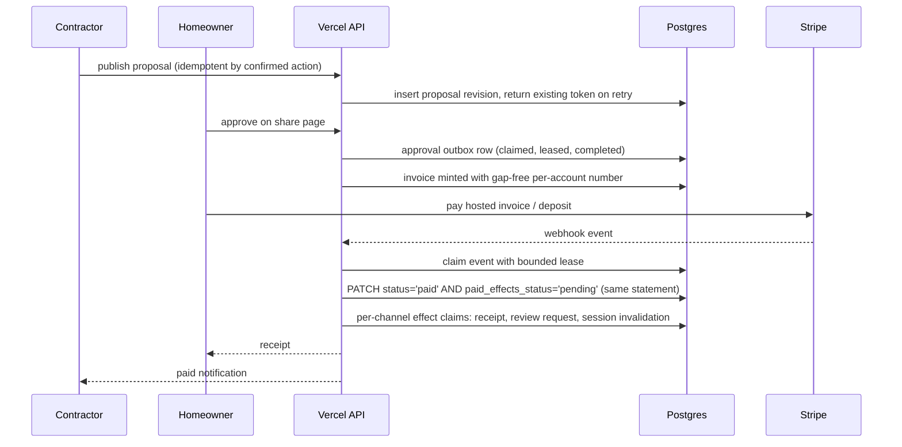
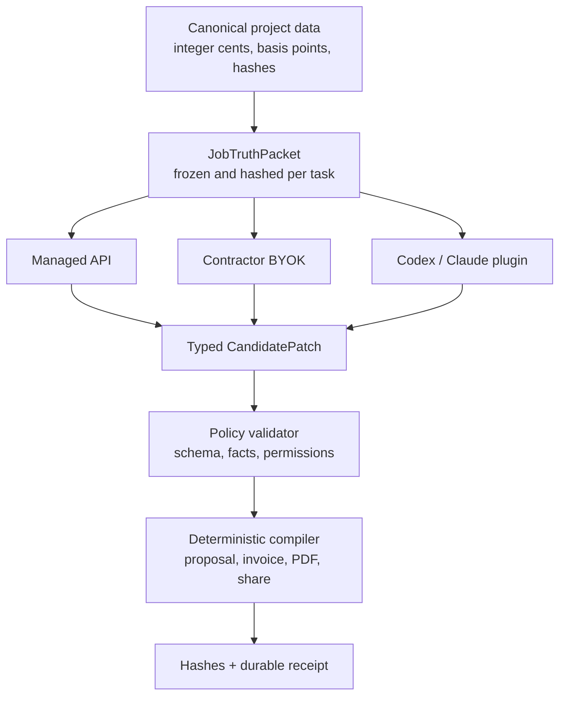

# LightDeck architecture

How a solo founder-operator's vertical SaaS is built, run, and kept honest. [LightDeck](https://www.lightdeck.tech) is a field, proposal, and invoicing workspace for landscape lighting contractors. I built it for my own company first, then shipped it for the trade.

The private repository is 2,785 commits over 98 days. This repo is the public architecture record: the system, the request flows, the tenancy and safety model, the test strategy, and the decisions with their reasons. The SQL behind the database patterns is in [supabase-production-patterns](https://github.com/ZCOLLINSKY/supabase-production-patterns).

## System

The browser never reads application data from Supabase directly. It uses Supabase Auth for the OTP sign-in and then talks only to the API, which authenticates every database call with the service role. That single choice is what makes "RLS on, no browser policies, deny by default" safe to enforce.

## Money path

Two rules make this survivable: the webhook is claimed before any effect runs, and the "paid" commit and the "effects pending" marker are the same write. A crash anywhere after that leaves durable work for the sweep, not a customer who paid and never got a receipt.

## AI boundary

LightDeck is the system of record and the artifact compiler. Models are replaceable workers.

A model may propose bounded copy, classifications, placement suggestions, or image pixels. It may never be the source of truth for money, identity, legal terms, project state, or what gets sent. Every AI task starts from an immutable truth packet; a missing fact is `null` or listed in `unknowns`, never replaced with a plausible default inside a prompt. Renders are verified by a second model against the design before they are shown, and each one is bound to a receipt of the hashes that produced it. Full decision record: [docs/ai-runtime-architecture.md](docs/ai-runtime-architecture.md).

## Tenancy

- Every application table carries `account_id`. Opaque ids are `text` matching a strict charset regex enforced by `CHECK`, never filenames, never uuids the browser can guess.
- Composite tenant keys lead every primary key and index in the rendering spine after two accounts sharing a project id and source id produced a byte-identical cache key. That cross-tenant hit is the reason the tuple is never narrowed.
- A `LIGHTDECK_SINGLE_TENANT` flag exists so the founder account can run the product as a single-tenant install while the multi-tenant paths stay exercised by tests.
- Sessions, magic links, and team invites are server-minted tokens with global uniqueness enforced in the database.

## Limits and circuits

- **Rate limits** live in Postgres (`charge_ai_usage`) because serverless instances share nothing. On Vercel the limiter fails closed by construction.
- **AI spend** has per-account daily and monthly unit caps, a fleet-wide daily cap, an org-level monthly dollar ceiling, and a render verifier circuit that opens after repeated verification failures. All are environment-configured and enforced server-side.
- **Outbound messages** pass one gate: per-account halt rows, daily caps, per-recipient cooldown via salted hash, dedupe replay, and actor attribution, in one table. The global halt is an env flag so it works while the database is down.
- **Render budgets** are time-boxed with a retry reserve so a slow provider cannot eat the function's wall clock.

## Tests and gate

517 Playwright test files across regression (341), end-to-end (113), visual (13), mobile (11), accessibility (3), and adversarial (2) lanes.

The production branch is protected by a gate that runs on four self-hosted Mac runners: a foundation job (source and browser-global contracts, API and money-path contracts, desktop visual baselines with zero retries, repository health) plus four browser shards. The gate uploads compact receipts, not multi-gigabyte reports, after a storage exhaustion incident.

"Honest tests" is a standing rule: a green test that certifies unchanged behavior is not evidence of correct behavior. The adversarial lane exists to attack the app's own claims, and audit waves re-verify what agents report as fixed.

## How the code gets written

I run fleets of Claude Code and Codex agents. They open PRs against the production branch; the gate judges them; audit waves verify the claims in the PR bodies against the running system before merge. A hardening audit this week shipped three waves (sign-in cohort, money path, render honesty, observability, ledger, onboarding edges, runbooks) as reviewed PRs. The agents type. The gate, the receipts, and I decide.

## Decisions

**Postgres ledger over Redis for rate limiting.** A second datastore adds an outage mode and a consistency question. One atomic RPC in the database I already run is simpler to reason about and fails closed with the same dependency as everything else.

**Fail closed in production, degrade in development.** The rate limiter, the render attempt store, and the outbound gate all refuse in production when their backing table is unreachable. The alternative is silently unlimited spend or duplicate customer messages during exactly the incidents that make tables unreachable.

**Service role only, RLS forced anyway.** The browser has no data path, so RLS could look redundant. It is not: it turns the architecture into a database invariant, so a leaked anon key or a future direct client sees zero rows. The event trigger extends that to objects nobody has written yet.

**Append-only receipts instead of mutable status columns.** Provenance you can edit is not provenance. Hash-bound rows with a mutation-rejecting trigger are the audit trail for every image a homeowner sees.

**Outbox in the row, not a separate queue.** Writing `paid_effects_status='pending'` in the same statement as `status='paid'` removes the window where a queue enqueue could fail after the commit. The sweep is the consumer.

**One outbound gate table.** Four controls that must agree (halt, cap, cooldown, dedupe) are cheaper to reason about, and to halt, when they share a ledger. This replaced a plan for four library files.

**Self-hosted runners.** Visual baselines and full browser shards on hosted runners were slow and cost-unbounded. Four runners on hardware I own give deterministic environments and let me run the full gate on every PR.

**Models never own money or identity.** The typed truth packet and the policy validator exist so switching providers can never change a total, a deposit, a warranty, or a share link. This was a rewrite decision, not a prompt tweak.

## Runbooks

- [docs/incident-rollback.md](docs/incident-rollback.md): decide whether it is a rollback, find previous-good, emergency instant rollback, verification triple, mandatory revert PR the same night, and the write-up.
- Backup and restore lives with the SQL in the patterns repo.
- Secret rotation and production migration go/no-go lists exist privately; the migration runbook requires a verified count of migrations, indexes, constraints, and RPCs from a clean release commit before the SQL editor is opened.

## Sources

Every claim above maps to a file in the private repository; see [SOURCES.md](SOURCES.md).

## Author

Zach Collins. Army veteran, founder-operator of a lighting installation company in Central Kentucky, and the solo builder of LightDeck. [github.com/ZCOLLINSKY](https://github.com/ZCOLLINSKY) · [LinkedIn](https://www.linkedin.com/in/zachcollins-ky)
